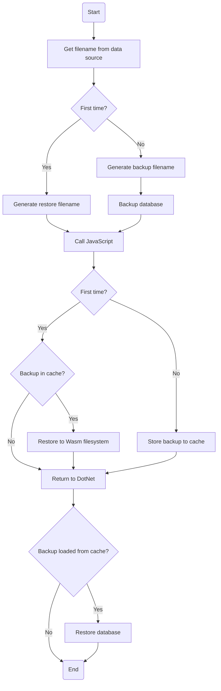

# SqliteWasmHelper

[](https://github.com/JeremyLikness/SqliteWasmHelper/actions/workflows/build.yml)
[](https://github.com/JeremyLikness/SqliteWasmHelper/actions/workflows/tests.yml)
[](https://github.com/JeremyLikness/SqliteWasmHelper/actions/workflows/documentation.yml)

Download this package from [Nuget](https://www.nuget.org/packages/SqliteWasmHelper/).

`SqliteWasmHelper` is a package designed to make it easy to work with SQLite databases
in Blazor Wasm apps. Although you *could* install [Eric Sink](https://github.com/ericsink)'s 
[SQLitePCLRaw.bundle_e_sqlite3](https://www.nuget.org/packages/SQLitePCLRaw.bundle_e_sqlite3/) 
package directly, that will only provide an in-memory implementation. This package 
automatically injects the code needed to persist your database in cache with the
help of [EF Core](https://docs.microsoft.com/ef). 

> **WARNING** The browser cache is both easily accessible by the end user and can be flushed
any time. Do not use SQLite in the browser to store sensitive data. Do not use it to store
user-entered data unless the data is temporary in nature or you have a process to synchronize
data to the back end. 

## Links

- [MIT license](./LICENSE.txt)
- [API documentation](./SqlWasmHelper/docs/SqliteWasmHelper.md)
- [Release notes](./ReleaseNotes.md)
- [Contributing](./CONTRIBUTING.md)
- [Code of conduct](./CODE_OF_CONDUCT.md)

## Quick start

Let's get right to the point!

### Prerequisites

For the Wasm client to get properly linked, you must have the [WebAssembly Tools workload](https://docs.microsoft.com/en-us/core/blazor/webassembly-native-dependencies)
installed.

### Instlallation and use

1. Install the lastest [SQlite in WebAssembly helper NuGet package](https://www.nuget.org/packages/SqliteWasmHelper/) or reference the `SqliteWasmHelper` project. This automatically installs all necessary dependencies:
    1. `SqliteWasmHelper`
    1. [Entity Framework Core and the SQLite provider](https://www.nuget.org/packages/Microsoft.EntityFrameworkCore.Sqlite.Core/)
    1. The [SQLitePCLRaw.bundle](https://www.nuget.org/packages/SQLitePCLRaw.bundle_e_sqlite3/) for running SQLite in WebAssembly
1. Add the following to the `.csproj` file for your Blazor WebAssembly project (it can be added to an
existing `PropertyGroup`):
    ```xml
    <PropertyGroup>
        <WasmBuildNative>true</WasmBuildNative>
    </PropertyGroup>
    ```
1. Add `using SqliteWasmHelper;` to the top of the `Program.cs` file in your Blazor WebAssembly project
1. Use the extension method to add a special `DbContext` factory:
    ```csharp
      builder.Services.AddSqliteWasmDbContextFactory<ThingContext>(
        opts => opts.UseSqlite("Data Source=things.sqlite3"));
    ```
1. Inject the factory into the components that need it
    ```csharp
    @inject ISqliteWasmDbContextFactory<ThingContext> Factory
    ```
1. Use the `DbContext` as you normally would
    ```csharp
    using var ctx = await Factory.CreateDbContextAsync();
    ctx.Things.Add(new Thing { Name = newThing });
    await ctx.SaveChangesAsync();
    ```
1. If you want access to the file, look at the [GenerateDownloadLinkAsync](SqliteWasmHelper/docs/SqliteWasmHelper/IBrowserCache/GenerateDownloadLinkAsync.md) documentation
or use/customize the [BackupLink](https://github.com/JeremyLikness/SqliteWasmHelper/blob/main/SqliteWasmHelper/BackupLink.razor) component.

The `BlazorWasmExample` is a working example to show it in use.

> **⚠️ IMPORTANT** The helper requires JavaScript interop to store the database in cache. For this reason, it is important you **always call `SaveChangesAsync` not `SaveChanges` when saving updates**. Any other operations such as calling `EnsureCreated` or executing queries can be done either synchronously or asynchronously.

> **⚠️ ALSO IMPORTANT** The helper calls `EnsureCreated` on the database before 
passing control to JavaScript. This won't  conflict with other calls but may lead to 
unexpected behavior. For example, if you seed your database based on a successful call, 
you will need to change your logic to check for data in tables instead of using the `EnsureCreated`
result.

## How it works

When your app requests a `DbContext`, the special factory uses JavaScript interop to 
check for the existence of a cache. If the cache exists, it is restored and returned,
otherwise a new database is created.



The first time you context is generated, the database will be restored if a backup exists in cache. Any call to `SaveChangesAsync` will result in the database being saved to cache.

To see the cache, open developer tools in your browser and navigate to Application -> Cache -> Cache Storage -> SqliteWasmHelper. The key for your database is `/data/cache/filename`.

## Access your database for troubleshooting

Run the application and use F12 to open developer tools. Navigate to the Console tab. Open the cache:

```javascript
const cache = await caches.open('SqliteWasmHelper');
```

Now load the database backup from the cache. Swap `things.db` with the filename of *your* database.

```javascript
const resp = await.cache.match('/data/cache/things.db');
```

If the `resp` instance is populated, access the underlying blob:

```javascript
const blob = await resp.blob();
```

Finally, generate the link. This should emit a link to the console you can click on to download your database.

```javascript
URL.createObjectURL(blob);
```

You can then examine the database with your SQLite tool of choice. You can use a similar approach for synchronization but sending the blob to the server.

## API documentation

Read the autogenerated
[API Docs](SqliteWasmHelper/docs/SqliteWasmHelper.md).

## Release notes

Read the [release notes](./ReleaseNotes.md).

## Summary

Questions? DM [@JeremyLikness](https://twitter.com/JeremyLikness) or open a
[GitHub issue](https://github.com/JeremyLikness/SqliteWasmHelper/issues/new).
